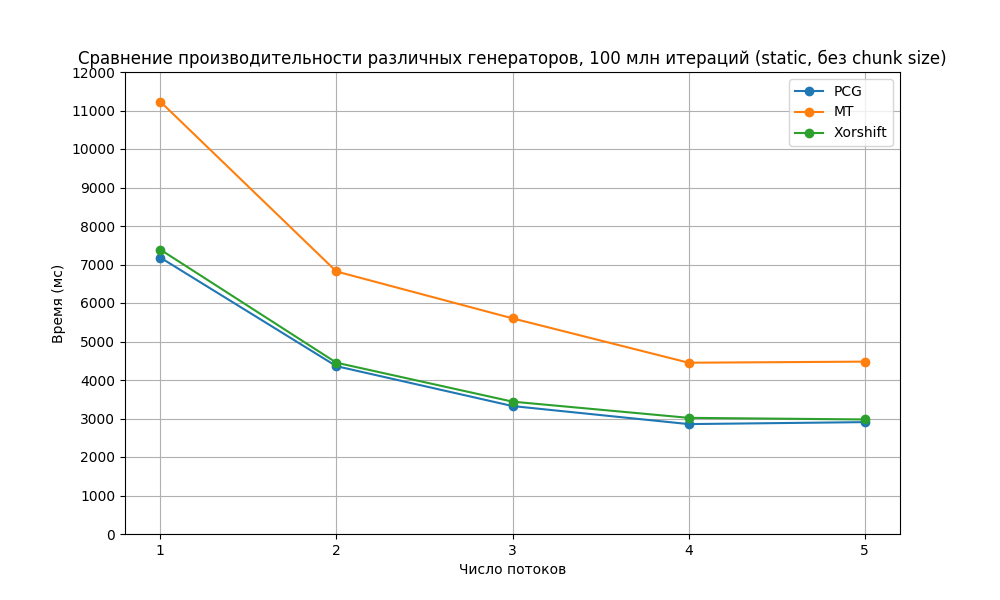
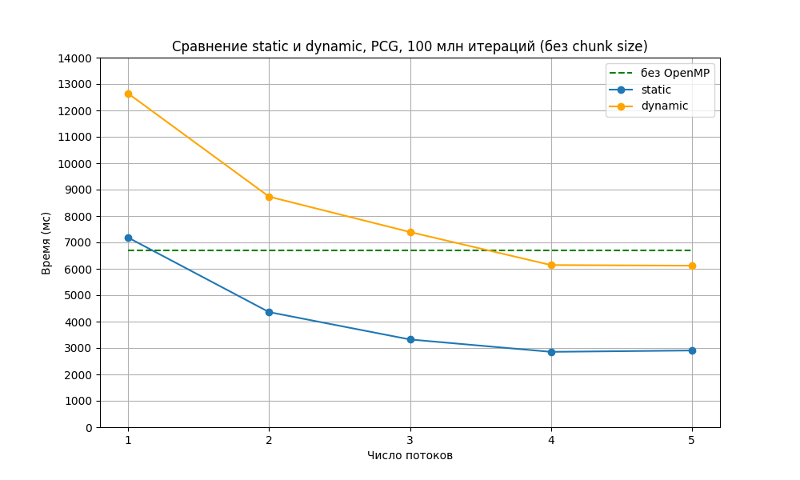
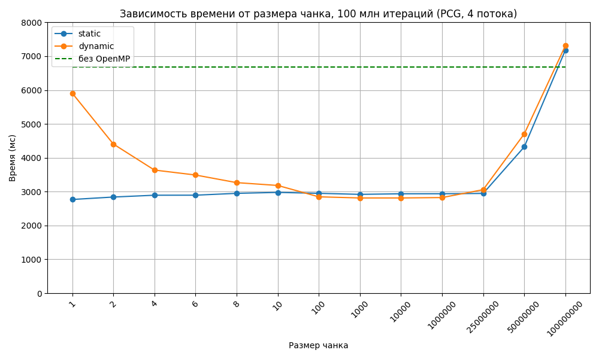
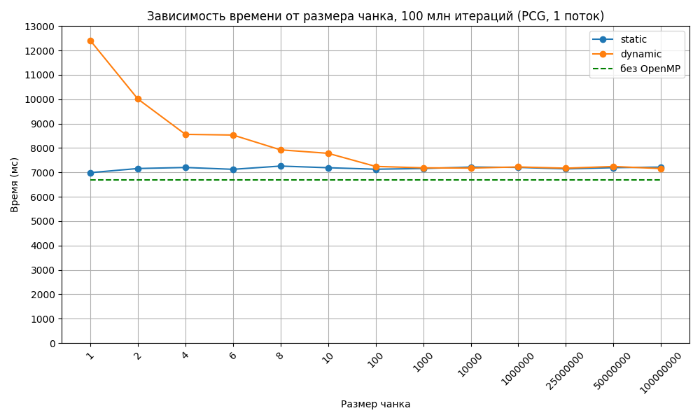
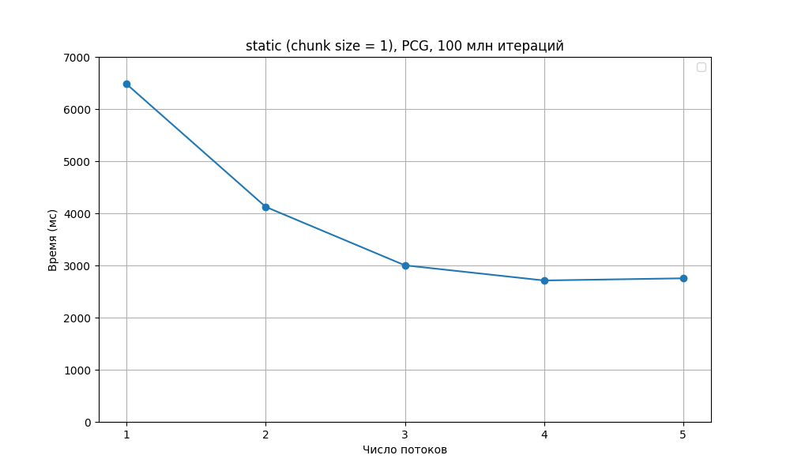

| Лабораторная работа №4 | M3101 | АОВС |
| ---------------------- | ----------- | ---- |
| OpenMP                 | Дорохина Елена       | 2024 |


## Инструментарий
Язык С++17, стандарт OpenMP 2.0. IDE Clion, компилятор cygwin64 3.5.0 c++

## Что реализовано
полная версия

## Результат работы на тестовых данных: <https://github.com/skkv-itmo-comp-arch/se-ca24-backlog-omp-kaleidostop/actions/runs/10802062866> 

# Описание:
### Результат работы программы
при N = 100000000

V = 1.25654

Time(4 thread(s)): 2711.93 ms 

Процессор, на котором производилось тестирование:
Intel Core i3-8145U CPU @ 2.10GHz (2 ядра, 4 логических процессора)

### Используемые конструкции 

**\#pragma omp parallel num_threads(n_threads)**
создает область, в которой код будет выполняться параллельно заданным n_threads количеством потоков  

**\#pragma omp for schedule(static[dynamic], chunk_size) nowait**
распределяет итерации цикла for между потоками 
- static: делит итерации на куски фиксированного размера (chunk_size), которые заранее распределяются между потоками. По умолчанию (без chunk_size) итерации делятся равномерно между потоками 
- dynamic: делит итерации на куски, которые выделяются во время работы программы. Новый чанк выделяется первому свободному потоку. По умолчанию (без chunk size) потоки получают по одной итерации.

**nowait** указывает, чтобы потоки не ждали окончания выполнения итерации другими потоками, а сразу переходили к следующей

**\#pragma omp atomic**
гарантирует, что итерация будет выполнена атомарно, то есть не произойдет гонки при попытке записать данные

**omp_get_wtime()**
возвращает текущее время с момента начала программы (в секундах)

**omp_get_max_threads()**
возвращает максимальное количество потоков, которые могут быть использованы

**omp_get_thread_num()**
возвращает номер потока, в котором вызывается


### Описание работы кода
#### Аргументы
- При передаче аргумента --no_omp запускается однопоточная реализация кода.
- При передаче аргумента --omp-threads default число потоков приравнивается к максимально возможному для данного процессора, которое определяется с помощью **omp_get_max_threads()**
- При передаче аргумента --omp-threads [число] число потоков приравнивается к [числу]
- --input [файл], --output [файл]

#### Метод Монте-Карло

Для подсчета объема с помощью метода Монте-Карло надо посчитать, сколько раз из N произошло попадание случайной точки в область, ограниченную поверхностью. После этого объем фигуры получается как результат умножения относительного числа попаданий на объем куба, внутри которого находится поверхность и генерируются точки. Подсчет числа попаданий в цикле можно распараллелить.

#### Оптимизации цикла
Основная часть кода -- цикл. Цикл распараллеливается с помощью **#pragma omp for**, с помощью **schedule(kind[, chunk_size])** устанавливается способ разделения итераций по потокам. Внутри цикла должно происходить увеличение переменной hit. Но если использовать одну переменную в разных потоках, может произойти конфликт: разные потоки считают значение переменной одновременно и оба запишут обратно значение hit+1 вместо суммарного hit+2.
Для избежания этого для каждого потока создается локальная переменная local_hit, в которой считается число попаданий для данного потока, а потом локальные переменные складываются в общую переменную hit.
Вместо создания локальных переменных можно было использовать перед ++hit директиву **atomic**, которая предотвращает конфликты, но она работает слишком долго. Тем не менее, эта директива используется при склеивании переменных после цикла, где разница в скорости не так критична. 

Иллюстрация подсчета hit:
``` c++
        long long local_hit = 0;
#pragma omp for schedule(static, chunk_size)
        for (int i = 0; i < N; ++i) {
            float x = x_distribution(generator);
            float y = y_distribution(generator);
            float z = z_distribution(generator);
            if (hit_test(x, y, z)) {
                ++local_hit;
            }
        }
#pragma omp atomic
        hit += local_hit;
```

Для ускорения этот код далее был модифицирован, чтобы на каждой итерации менялись не 3 координаты, а только одна. При этом:
- затрачивается в 3 раза меньше времени на генерацию чисел
- уже использованные значения координат хранятся в кэше, за счет чего при повторном вызове с теми же значениями тратится меньше времени на обращение к памяти. 

Также была добавлена опция **nowait**, чтобы потоки не ожидали завершения других потоков.

#### hit.cpp
Функция hit_test определяет, попадает ли точка в область, ограниченную фигурой (т.е Ф(x, y, z) < 0, где Ф -- уравнение, задающее поверхность piriform с параметром a = 2).
Для сокращения числа умножений x * x выносится в отдельную переменную x2, в Ф x2 выносится за скобки.

Функция get_axis_range задает границы куба, в котором лежит фигура. От размера границ зависит число промахов и точность вычисления объема. В данном случае границы первоначально подбирались на глаз по компьютерной модели фигуры, затем были уточнены с помощью дифференцирования. 

#### Генерация рандомных чисел
Проверялись разные генераторы рандомных чисел.
Во всех случаях используется thread_local генератор, чтобы каждый поток генерировал числа независимо от других потоков, что минимизирует риск конфликтов.
Кроме того, каждому генератору задается разное начальное состояние в зависимости от номера потока. Для разных осей координат также используются разные генераторы (в случае mt19937 -- распределения), чтобы они точно не зависели друг от друга.
Генератор rand() не проверялся, так как у него есть общее внутреннее состояние и потому он не потокобезопасный.

Протестированные генераторы:
- std::mt19937 из стандартной библиотеки random.
- xorshift
- pcg32

Последние два генерируют числа типа uint32_t, и для того, чтобы использовать их для генерации float, был написан следующий код:  

``` c++
float nextFloat(const float & min, const float & max) {
    union {
        uint32_t i;
        float f;
    } u;
    u.i = (next() >> 9) | 0x3F800000;

    return (u.f - 1.f) * (max - min) + min;
    }
```

Сдвиг >> 9 -- получение старших 23 бит числа для мантиссы. Операция | 0x3F800000 -- приравнивание экпоненты к 0. Получаем битовое представление случайного float в диапазоне [1, 2). Для получения float в диапазоне [0, 1) вычитаем единицу, дальше преобразуем число для попадания его в заданный диапазон.

Этот способ быстрее, чем стандартный способ получения float из uint32_t путем деления на максимальное uint32_t, т.к. используются более дешевые операции, чем деление floating point.


### Тестирование 
При тестировании время выполнения усреднялось по 4 вызовам (в случае no-omp -- по 10 вызовам), а также отслеживалось состояние загруженности системы и не запускались посторонние программы.

Сравнение проводилось по следующим параметрам:
- различные генераторы



Был выбран генератор PCG, показавший себя немного быстрее xorshift и значительно быстрее MT19937 и обладающий более хорошими статистическими характеристиками, чем остальные протестированные генераторы.

- различные значения числа потоков при одинаковом параметре schedule (без chunk_size);



При увеличении числа потоков время уменьшается, пока число потоков не становится максимальным возможным (в данном случае -- 4 потока).

Когда chunk size не указывается, по умолчанию static запускается с chunk_size = N / num_threads, dynamic запускается с chunk_size = 1.

В таких условиях static оказался значительно быстрее dynamic. Это потому, что в static итерации распределялись между потоками заранее, так что в процессе выполнения кода время на это не тратилось, а в dynamic время на распределение потоков тратилось после каждой итерации.
Код без использования OpenMP оказался чуть-чуть быстрее запуска параллельной версии с одним потоком, потому что не тратилось время на управление распараллеливанием. 


- различные параметры schedule (с chunk_size) при одинаковом значении числа потоков;

1. Число потоков -- default (4)



При увеличении chunk size dynamic приближается к static. Это происходит потому, что становится меньше чанков и значит во время выполнения кода тратится меньше времени на распределение чанков по потокам.

При chunk size > N / num_threads одним потокам достается меньше других, вплоть до того, что при chunk size = N все итерации достаются только одному потоку, поэтому время исполнения приближается ко времени работы одного потока.

Быстрее всего отработал static с chunk size = 1.

2. Число потоков -- 1.



При одном потоке разница в chunk size также проявляется, потому что все еще тратится время на распределение чанков, несмотря на то, что они распределяются одному потоку.

При увеличении N не происходит такого же замедления, как в первом случае, потому что все итерации уже выполняются одним потоком.


- Итак, в ходе тестирования было определено, что оптимальнее всего использовать schedule с параметром static и chunk size = 1, а числа генерировать с помощью PCG.



